# ERD — Swarm Intelligence Lending Network

## Mermaid (render in GitHub / VS Code Mermaid preview)

```mermaid
erDiagram
    customers ||--o{ customer_mobile_links : links
    mobile_numbers ||--o{ customer_mobile_links : linked_by
    customers ||--o{ customer_address_links : lives_at
    addresses ||--o{ customer_address_links : addressed_by
    dealers ||--o{ dealer_customer_links : serves
    customers ||--o{ dealer_customer_links : served_by
    addresses ||--o{ dealers : located_at
    customers ||--o{ customer_bank_links : owns
    bank_accounts ||--o{ customer_bank_links : owned_by
    customers ||--o{ customer_device_links : uses
    devices ||--o{ customer_device_links : used_by
    customers ||--o{ loan_applications : applies
    dealers ||--o{ loan_applications : sources
    loan_applications ||--o| loans : disburses
    loans ||--o{ payments : paid_by
    loans ||--o{ repayment_behaviour : derives
    guarantors ||--o{ loan_guarantors : guarantees
    loan_applications ||--o{ loan_guarantors : guaranteed_by
    mobile_numbers ||--o{ guarantors : contact
    addresses ||--o{ guarantors : located
    locations ||--o{ application_events : at
    devices ||--o{ application_events : via
    ip_addresses ||--o{ application_events : from
    customers ||--o{ application_events : acts
    loan_applications ||--o{ application_events : for
    fraud_clusters ||--o{ fraud_cluster_members : contains
    fraud_clusters ||--o{ fraud_alerts : triggers
    fraud_alerts ||--o{ investigations : investigated_by
    investigations ||--o{ investigation_actions : audited
    model_versions ||--o{ predictions : produces

    customers { uuid customer_id PK }
    mobile_numbers { uuid mobile_id PK }
    addresses { uuid address_id PK }
    bank_accounts { uuid bank_account_id PK }
    devices { uuid device_id PK }
    ip_addresses { uuid ip_id PK }
    dealers { uuid dealer_id PK }
    loan_applications { uuid application_id PK }
    loans { uuid loan_id PK }
    guarantors { uuid guarantor_id PK }
    payments { uuid payment_id PK }
    locations { uuid location_id PK }
    application_events { uuid event_id PK }
    entity_relationships { uuid relationship_id PK }
    fraud_signals { uuid signal_id PK }
    risk_scores { uuid risk_score_id PK }
    fraud_clusters { uuid cluster_id PK }
    fraud_cluster_members { uuid member_id PK }
    fraud_alerts { uuid alert_id PK }
    investigations { uuid investigation_id PK }
    investigation_actions { uuid action_id PK }
    model_versions { uuid model_id PK }
    predictions { uuid prediction_id PK }
    audit_logs { uuid audit_id PK }
```



## Polymorphic relationships (not hard FKs)

These tables reference **any** entity via `(entity_type, entity_id)`:

| Table | Columns | Allowed entity_type |
|-------|---------|---------------------|
| `entity_relationships` | source/target | CUSTOMER, MOBILE, DEVICE, BANK_ACCOUNT, ADDRESS, DEALER, GUARANTOR, IP, LOAN, APPLICATION, LOCATION |
| `fraud_signals` | entity | + CLUSTER |
| `risk_scores` | entity | CUSTOMER, LOAN, APPLICATION, DEALER, DEVICE, CLUSTER |
| `fraud_cluster_members` | entity | CUSTOMER, MOBILE, DEVICE, BANK_ACCOUNT, ADDRESS, DEALER, GUARANTOR, IP, LOAN, APPLICATION |
| `fraud_alerts` | entity + cluster_id FK | CUSTOMER, LOAN, APPLICATION, DEALER, DEVICE, CLUSTER |
| `predictions` | entity | CUSTOMER, LOAN, APPLICATION, DEALER, DEVICE, CLUSTER |
| `audit_logs` | entity | open |

Hard FKs exist only where the target table is fixed (e.g. `customer_mobile_links.customer_id → customers`). See `schema/004_relationships.sql`.

## Swarm layer highlight

```
CUSTOMER ──(:SHARED_DEVICE)──► DEVICE ──(:SAME_IP)──► IP
   │  ├─(:SHARED_MOBILE)──► MOBILE
   │  ├─(:SHARED_BANK_ACCOUNT)──► BANK_ACCOUNT
   │  ├─(:SHARED_ADDRESS)──► ADDRESS
   │  ├─(:SAME_DEALER)──► DEALER
   │  └─(:SHARED_GUARANTOR)──► GUARANTOR
   └─(:SUSPICIOUS_LINK)──► CUSTOMER
                ↓
        entity_relationships
                ↓
        fraud_cluster_members → fraud_clusters → fraud_alerts → investigations
```
